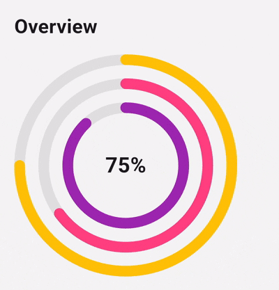
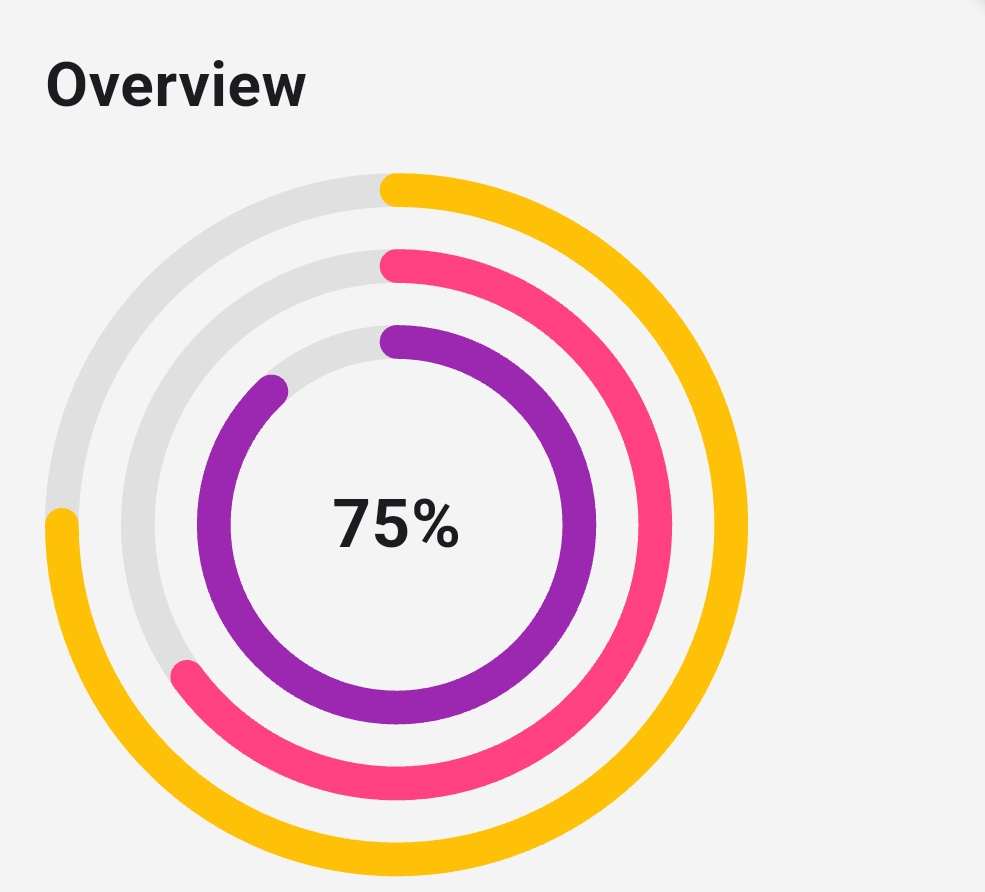

<!--
This README describes the package. If you publish this package to pub.dev,
this README's contents appear on the landing page for your package.

For information about how to write a good package README, see the guide for
[writing package pages](https://dart.dev/tools/pub/writing-package-pages).

For general information about developing packages, see the Dart guide for
[creating packages](https://dart.dev/guides/libraries/create-packages)
and the Flutter guide for
[developing packages and plugins](https://flutter.dev/to/develop-packages).
-->

# 📘 `multi_nested_circular_progress`
<!-- PACKAGE BADGES -->
<p align="center">
  <!-- Pub.dev version -->
  <a href="https://pub.dev/packages/multi_nested_circular_progress">
    
  </a>

  <!-- Pub.dev likes -->
  <a href="https://pub.dev/packages/multi_nested_circular_progress/score">
    
  </a>

  <!-- Pub.dev points -->
  <a href="https://pub.dev/packages/multi_nested_circular_progress/score">
    
  </a>

  <!-- Pub.dev popularity -->
  <a href="https://pub.dev/packages/multi_nested_circular_progress/score">
    
  </a>

  <!-- GitHub Stars -->
  <a href="https://github.com/Uchyy/multi_nested_circular_progress">
    
  </a>

  <!-- GitHub contributors -->
  <a href="https://github.com/Uchyy/multi_nested_circular_progress/graphs/contributors">
    
  </a>

  <!-- GitHub closed issues -->
  <a href="https://github.com/Uchyy/multi_nested_circular_progress/issues?q=is%3Aissue+is%3Aclosed">
    
  </a>

  <!-- Buy Me A Coffee -->
  <a href="https://www.buymeacoffee.com/uchyy">
    
  </a>

  <!-- GitHub Sponsors -->
  <a href="https://github.com/sponsors/Uchyy">
    
  </a>
</p>

A simple, elegant Flutter package for displaying **multiple animated nested circular progress rings**, perfect for dashboards, analytics, fitness stats, achievements, level progress, and more.

## 

## ✨ Features

* 🎨 Multiple customizable concentric progress rings
* 🔄 Smooth animation from 0 → progress
* ⚡ Auto-animates again when values change
* 🧩 Custom center widget (text, icons, images)
* 📏 Adjustable stroke width and ring spacing
* 🧵 Stateless implementation using `TweenAnimationBuilder`
* 📦 Lightweight — zero dependencies
* ✔ Flutter Web, iOS, Android, and Desktop support


## 🚀 Getting Started

Add the dependency to your app’s `pubspec.yaml`:

```yaml
dependencies:
  multi_nested_circular_progress: ^1.0.0
```
  
## 📦 Basic Usage

```dart
MultiNestedCircularProgress(
  size: 180,
  strokeWidth: 12,
  progresses: [0.8, 0.55, 0.30],
  colors: [
    Colors.amber,
    Colors.pinkAccent,
    Colors.purple,
  ],
  child: Text(
    "80%",
    style: TextStyle(
      fontSize: 26,
      fontWeight: FontWeight.bold,
    ),
  ),
);
```
  

## 🧪 Example (from the `/example` app)

```dart
class StatsExample extends StatelessWidget {
  const StatsExample({super.key});

  @override
  Widget build(BuildContext context) {
    final adjustedPlays = 0.75;
    final average = 65;
    final best = 88;

    return Column(
      crossAxisAlignment: CrossAxisAlignment.start,
      children: [
        const Padding(
          padding: EdgeInsets.all(16.0),
          child: Text(
            "Overview",
            style: TextStyle(
              fontSize: 22,
              fontWeight: FontWeight.w700,
            ),
          ),
        ),

        Row(
          children: [
            const SizedBox(width: 16),
            MultiNestedCircularProgress(
              size: 200,
              strokeWidth: 12,
              progresses: [
                adjustedPlays,
                average / 100,
                best / 100,
              ],
              colors: [
                Colors.amber,
                Colors.pinkAccent,
                Colors.purple,
              ],
              child: Text(
                "${(adjustedPlays * 100).toInt()}%",
                style: const TextStyle(
                  fontSize: 24,
                  fontWeight: FontWeight.w700,
                ),
              ),
            ),
          ],
        ),

        const SizedBox(height: 20),
      ],
    );
  }
}
```


## ⚙️ API Reference

### **MultiNestedCircularProgress**

| Parameter                | Type           | Description                                     |
| ------------------------ | -------------- | ----------------------------------------------- |
| `size`                   | `double`       | Diameter of the entire widget                   |
| `progresses`             | `List<double>` | Progress values (0.0 → 1.0) for each ring       |
| `colors`                 | `List<Color>`  | Color for each ring (same length as progresses) |
| `strokeWidth`            | `double`       | Thickness of each ring                          |
| `gap`                    | `double`       | Space between rings                             |
| `child`                  | `Widget?`      | Widget displayed in the center                  |
| `durationInMilliSeconds` | `int`          | Animation duration in ms (default: 800ms)       |


## 🎨 Customization Examples

### Change ring spacing

```dart
gap: 20,
```

### Slow down the animation

```dart
durationInMilliSeconds: 1500,
```

### Replace center text with an icon

```dart
child: Icon(Icons.star, size: 36, color: Colors.amber),
```

### Show only one ring

```dart
progresses: [0.9],
colors: [Colors.green],
```


## 🧩 Why Nested Rings?

This widget is ideal for:

* Game stats
* Skill/XP progress
* Fitness level / daily goals
* Productivity tracking
* Achievements overview
* Dashboard KPIs


### Preview



## 🤝 Contributing

Contributions are welcome!
Please open a pull request to the **main** branch.


## 🪪 License

`multi_nested_circular_progress` is MIT-licensed.
See the [LICENCE](/LICENSE) file for details.


## ⭐️ Support the Package

If you find this widget useful, please give it a ⭐ on GitHub!


